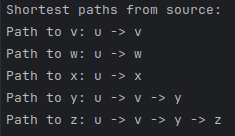
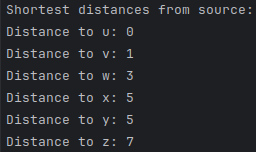

# Dijkstra's Shortest Path Algorithm

This is an implementation of Dijkstra's shorted path algorithm intended to generate forwarding tables from weighted graphs.
It takes a hardcoded definition of a graph (NODE -> NODE, Weight) and a source node, applied Dijkstra's algorithm and prints a forwarding table.

The output includes a formatted forwarding table, list of shortest distances from the source node to the other nodes, and a list of the shortest paths.

<div>
    
    
    
</div>

## Usage
### Running the program
```bash
# Clone the repository
git clone https://github.com/Crowley723/dijkstras-alg-go.git
cd dijkstras-alg-go

# Build the application
go build -o dijkstra

# Run the application
./dijkstra
```

## Possible Improvements:
- Allow graph definition by config file
- Allow the use of directed graphs
- Error checking for disconnected graphs
- ~~Implement Floyd-Warshall shortest path between any two nodes (rather than one source node and all other nodes)~~


## License:
[Apache 2.0](./LICENSE)